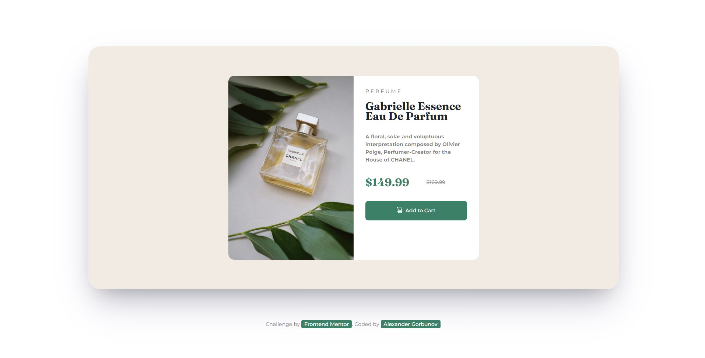
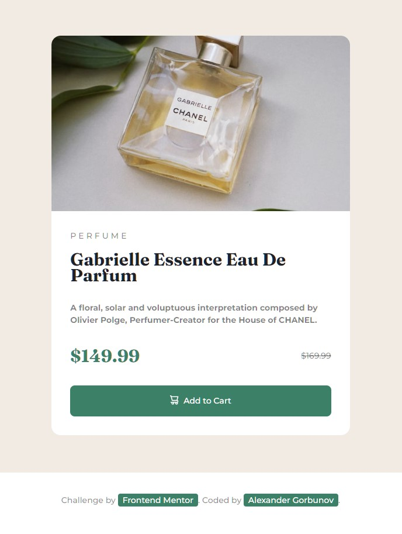

# Product preview card component solution

<h3 align="center">
  <strong>
    <a href="https://arlagonix.github.io/projects/product-preview-card-component-main">Open Demo in Github Pages</a>
  </strong>
</h3>

<p align="center">
  
</p>

<p align="center">
  
</p>

## ℹ️ About
  
This is a solution to the [Product preview card component challenge on Frontend Mentor](https://www.frontendmentor.io/challenges/product-preview-card-component-GO7UmttRfa).

* **Build out a product preview card component**
  * `/design` - Folder with  designs. Contains both a mobile and a desktop version of the design. 
  * `/images` - Folder with assets. The assets are already optimized.
  * `style-guide.md` - File with the style information: color palette, fonts, etc.
* **Get it looking as close to the design as possible**. 
* **Use any tools to like**. You can use any tools you like to help you complete the challenge**. So if you've got something you'd like to practice, feel free to give it a go.

## ⚙️ Tools

* **HTML5**
  * Semantic HTML
* **CSS**
  * BEM naming convention
  * Responsive design
  * Flexbox
* **Github Pages** - for hosting

## 💡 Features

* **Animation on hover and click**. Click on the button

## 📍 Additional information

### Nice button animations

Found out how to make nice button animations:

```css
.button {
  transition: 0.3s;
}

.button:hover {
  background: var(--very-dark-blue);
  transform: scale(0.95);
  cursor: pointer;
}

.button:active {
  transform: scale(0.85);
}
```

### Animation on window resize

Also found out that `transition: .3s;` helps to add nice animations on media queries when you resize the window.

### Appeared to be more difficult than expected

It ocurred that such a simple card required much more time and effort to develop than I had thought. I still need more and more practice with CSS.

### Experimented with horizontal rulers

That helped me not to set manually margins for each element. Saw such a solution on one project long ago.

```html
<article class="card__content">
  <p class="card__prod-type text">perfume</p>
  <hr class="hr" />
  <header>
    <h1 class="card__header" lang="fr">Gabrielle Essence Eau De Parfum</h1>
  </header>
  <hr class="hr hr--lg" />
  <p class="text text--style-bold">
    A floral, solar and voluptuous interpretation composed by Olivier Polge,
    Perfumer-Creator for the House of CHANEL.
  </p>
  <hr class="hr hr--lg" />
  <div class="card__prices">
    <p class="card__price">$149.99</p>
    <p class="card__old-price text"><del>$169.99</del></p>
  </div>
  <hr class="hr hr--lg" />
  <button class="button text">
    
    Add to Cart
  </button>
</article>
```

```css
.hr {
  border: 0;
  margin: 0.5rem 0;
}

.hr--lg {
  margin: 1rem 0;
}
```

### Tried to use BEM

Well, it ocurred to be better than my previous custom solutions. It added order to the code, helped to clearly distinguish html from css via classes. Previously I used tag selectors, descendant selectors in css, found that such approach made the code more difficult to read.

### Flexbox is a great instrument!

## 👤 Author

* Frontend Mentor - [@GrbnvAlex](https://www.frontendmentor.io/profile/GrbnvAlex)
* Telegram - [@Arlagonix](https://t.me/Arlagonix)
* Github - [@arlagonix](https://github.com/arlagonix)
